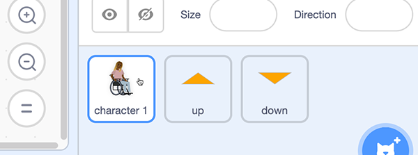

## Getting your character ready

--- task ---
Open the Scratch starter project.

**Online**: open the starter project at [rpf.io/skiingon](http://rpf.io/skiingon){:target="_blank"}.

**Offline**: open the [starter project](http://rpf.io/sit-stretch-go){:target="_blank"} in the offline editor.

If you need to download and install the Scratch offline editor, you can find it at [rpf.io/scratchoff](http://rpf.io/scratchoff){:target="_blank"}.

In the starter project, you should see a character sprite along with two arrow, one up and one down.


--- /task ---

First you are going give character 1 all her setup code such as where on the screen start.

--- task ---

Select the *character 1* sprite in the **Sprites Pane**



Start by adding a `when flag clicked`{:class="block3events"} block


```blocks3
when flag clicked
```

--- /task ---

--- task ---

Add a `go to x: y:`{:class="block3motion"} block from the `Motion`{:class="block3motion"} block palette.

Enter an **x value** of 70 and a **y value** of -25 to position *character 1* low down to the right of centre.


```blocks3
when flag clicked
+ go to x: (70) y: (-25)
```

--- /task ---