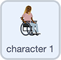

## Getting your character ready

--- task ---
Open the Scratch starter project.

**Online**: open the starter project at [rpf.io/skiingon](http://rpf.io/skiingon){:target="_blank"}.

**Offline**: open the [starter project](http://rpf.io/sit-stretch-go){:target="_blank"} in the offline editor.

If you need to download and install the Scratch offline editor, you can find it at [rpf.io/scratchoff](http://rpf.io/scratchoff){:target="_blank"}.

In the starter project, you should see a character sprite along with two arrow, one up and one down.

--- /task ---

First you are going give character 1 all her setup code such as where on the screen start.

--- task ---

--- /task ---