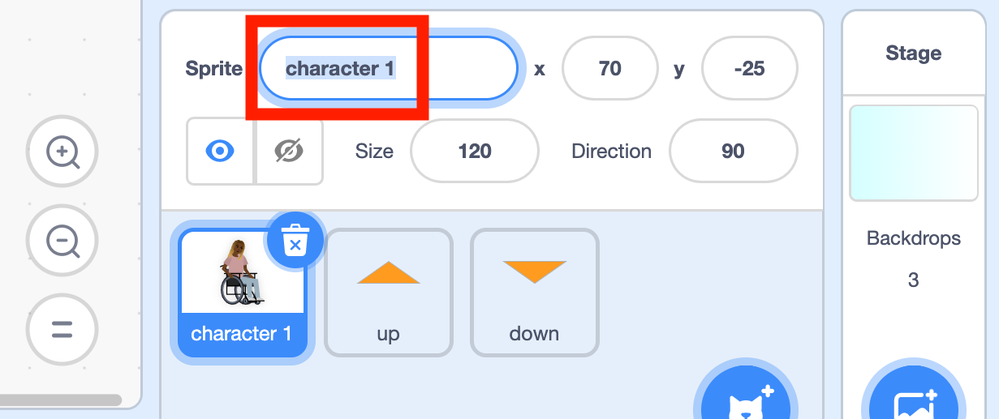

## Prepare your character

--- task ---

**Online:** Open the [starter project](http://rpf.io/p/en/sit-stretch-on){:target="_blank"} in Scratch.

**Offline:** Open the project [starter file](http://rpf.io/p/en/sit-stretch-get){:target="_blank"} in the Scratch offline editor. If you need to, you can [download and install Scratch here](https://scratch.mit.edu/download){:target="_blank"}.

You should see a character sprite and two arrows: up and down.


--- /task ---

First, you will give **character 1** a name.

--- task ---

Select the **character 1** sprite.

Click on the **dialogue box** that shows the sprite's name. We have named this sprite **Nadia**. Replace `character 1` with the name of your choice.



--- /task ---

Next, you will give **Nadia** setup blocks such as `position`{:class="block3motion"} on the Stage.

--- task ---

With the **Nadia** sprite still selected, add a `when green flag clicked`{:class="block3events"} block.

Below that, add a `go to x: y:`{:class="block3motion"} block with `x`{:class="block3motion"} set to `70` and `y`{:class="block3motion"} set to `-25`. 

Add a `switch costume to`{:class="block3looks"} block, and set the costume to `at rest`{:class="block3looks"}.

Finally, add a `wait 2 seconds`{:class="block3control"} block so that the first exercise doesn't begin too suddenly:


```blocks3
when flag clicked
go to x: (70) y: (-25)
switch costume to (at rest v)
wait (2) seconds
```

--- /task ---

--- save ---
