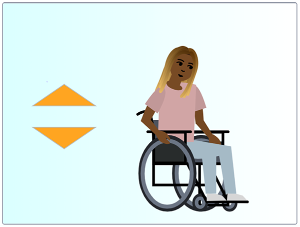

## Getting your character ready

--- task ---
Open the Scratch starter project.

**Online**: open the starter project at [rpf.io/skiingon](http://rpf.io/skiingon){:target="_blank"}.

**Offline**: open the [starter project](http://rpf.io/sit-stretch-go){:target="_blank"} in the offline editor.

If you need to download and install the Scratch offline editor, you can find it at [rpf.io/scratchoff](http://rpf.io/scratchoff){:target="_blank"}.

In the starter project, you should see a character sprite along with two arrow, one up and one down.



--- /task ---

First of all, you are going give **character 1** a name. In this project, she will be **Nadia** but you can use whatever name you like.

--- task ---

Select the **character 1** sprite in the **Sprites Pane**

Click on the _dialogue box_ showing the sprite name, and replace **character 1** with the name of your choice.


Click anywhere outside of the _dialogue box_ and you will see the name has now changed.

--- /task ---

Next, you will include all the setup blocks for **Nadia** such she starts on the Stage.

--- task ---

With the **Nadia** sprite still selected, go to `Events`{:class="block3events"} in the Blocks palette and add the `when flag clicked`{:class="block3events"} block.


```blocks3
when flag clicked
```

--- /task ---

--- task ---

From the `Motion`{:class="block3motion"} block palette, add a `go to x: y:`{:class="block3motion"} block.

Enter an **x value** of 70 and a **y value** of -25. This will position **Nadia** to the bottom right of the Stage.


```blocks3
when flag clicked
+ go to x: (70) y: (-25)
```

--- /task ---

--- task ---

To make sure **Nadia** starts using the correct costume, go to `Looks`{:class="block3looks"} in the Blocks palette and add a `switch costume to`{:class="block3looks"} block.

Set the costume to `at rest`{:class="block3looks"}.


```blocks3
when flag clicked
go to x: (70) y: (-25)
+ switch costume to (at rest v)
```

--- /task ---

The last thing you will do to prepare **Nadia** is to add a short wait so that the first exercise doesn't start too suddenly.

--- task ---

Go to `Control`{:class="block3looks"} block and add a `wait for 2 seconds`{:class="block3looks"} to make **Nadia** wait  before anything else happens.


```blocks3
when flag clicked
go to x: (70) y: (-25)
switch costume to (at rest v)
+ wait (2) seconds
```

--- /task ---
