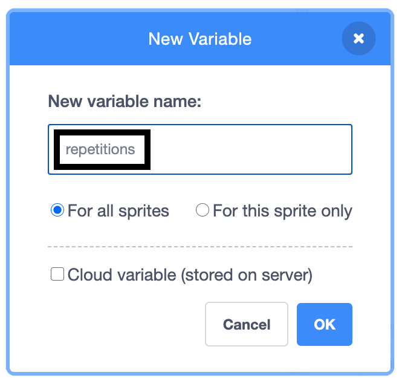
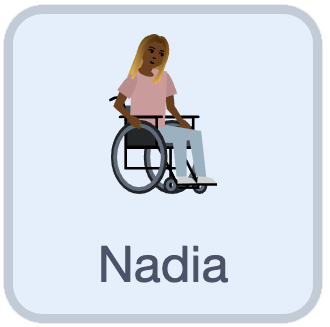

## Control the repetitions

Now, you will create a variable that will eventually allow a user to control the number of repetitions of each exercise.

--- task ---

Go to the `Variables`{:class="block3variables"} menu, click on Make a Variable, and name it `repetitions`.

{:width=“200px”}

The new variable will now appear in the `Variables`{:class="block3variables"} blocks section and also on the Stage. 

--- /task ---

The next step is to set the value of `repetitions`{:class="block3variables"} when the program starts.

--- task ---

With the **Nadia** sprite selected, add a `set repetitions to`{:class="block3variables"} block and set the value to `3`:



```blocks3
when flag clicked
+ set [repetitions v] to (3)
go to x: (70) y: (-25)
switch costume to (at rest v)
wait (2) seconds
repeat (2)
    switch costume to (breathe in v)
    say [breathe in]  for (2) seconds
    switch costume to (at rest v)
    say [breathe out]  for (2) seconds
end
```

--- /task ---

Now, you will use `repetitions`{:class="block3variables"} to control the number of times that the exercise repeats. 

--- task ---

Add a rounded `repetitions`{:class="block3variables"} block as the value of the `repeat`{:class="block3control"} block:


```blocks3
when flag clicked
set [repetitions v] to (3)
go to x: (70) y: (-25)
switch costume to (at rest v)
wait (2) seconds
repeat (repetitions ::variables +)
    switch costume to (breathe in v)
    say [breathe in]  for (2) seconds
    switch costume to (at rest v)
    say [breathe out]  for (2) seconds
end
```

--- /task ---

To check that this program works, you can change the value of `repetitions`{:class="block3variables"} and run the program.

--- save ---
