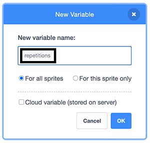

## The repetitions variable

Next you'll create a variable that will eventually allow the _user_ to control the number of repetitions of each exercise.

--- task ---

Go to the `Variables`{:class="block3variables"} block palette and click `Make a Variable`.

In the _dialogue box_ that opens up, give the new variable the name `repetitions`.



The new variable will now appear in the `Variables`{:class="block3variables"} palette and also in the Stage. 

Untick the box next to `repetitions`{:class="block3variables"} in the block palette to remove the variable display box from the Stage.


--- /task ---

The next step is to _initialise_ the new `repetitions`{:class="block3variables"} variable to give it an initial value when the program starts.

--- task ---

Make sure that the **Nadia** sprite is selected. Go to `Variables`{:class="block3variables"}, add a `set repetitions to`{:class="block3variables"} block and set the variable to `3`.


```blocks3
when flag clicked
+ set [repetitions v] to (3)
go to x: (70) y: (-25)
switch costume to (at rest v)
wait (2) seconds
repeat (2)
    switch costume to (breathe in v)
    say [breathe in]  for (2) seconds
    switch costume to (at rest v)
    say [breathe out]  for (2) seconds
end
```

--- /task ---

Now, when the program starts, `repetitions`{:class="block3variables"} will be set to `3`.

The next step is to use the new variable to control the number of times the exercise repeats. 

--- task ---

Add a rounded `repetitions`{:class="block3variables"} block as the value of the `repeat`{:class="block3control"} loop.  This means that the value of `repetitions`{:class="block3variables"} will match the number of times the exercise repeats.


```blocks3
when flag clicked
set [repetitions v] to (3)
go to x: (70) y: (-25)
switch costume to (at rest v)
wait (2) seconds
repeat (repetitions ::variables +)
    switch costume to (breathe in v)
    say [breathe in]  for (2) seconds
    switch costume to (at rest v)
    say [breathe out]  for (2) seconds
end
```

--- /task ---

One way to check that this program works is by changing the value of `repetitions`{:class="block3variables"} and running the program.
