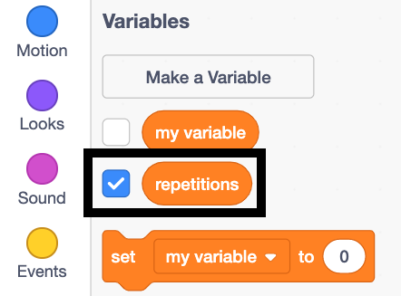

## Adding control to buttons

Now it is time to code your arrow buttons so you can use them to change the value of `repetitions`{:class="block3variables"} while the program is running.

--- task ---


Leave the existing code exactly as it is. Go to `Events`{:class="block3events"} and start a new script starting with an `when this sprite clicked`{:class="block3events"} block.


```blocks3
+ when this sprite clicked
```

--- /task ---

--- task ---

From `Control`{:class="block3control"}, add an `if... then... else...`{:class="block3control"} block. 


```blocks3
when this sprite clicked
+ if <> then
else
end
```

--- /task ---

The first thing you will add to the conditional `if... then... else...`{:class="block3control"} block are the following: the _conditional statement_ `if`{:class="block3control"} block, the `repetitions`{:class="block3variables"} block, and the `is less than 5`{:class="block3operators"} block.

--- task ---

From the green `Operators`{:class="block3operators"} in the Blocks paletter, drag a `less than`{:class="block3operators"} block.

```blocks3
<()<()>
```

In first empty field, add a rounded `repetitions`{:class="block3variables"} block.

```blocks3
<(repetitions)<()>
```

In the remaining empty field, add the number `5`.

```blocks3
<(repetitions ::variables)<[5]>
```

Now add this block into the hexagonal field of your `if... then... else...`{:class="block3control"} block.


```blocks3
when this sprite clicked
if <(repetitions ::variables)<[5] ::operators +> then
else
end
```

--- /task ---

The first empty space defines what happens if the _conditional statement_ is `true`, which means that the number of repetitions is less than 5 (that is, equal to or less than 4).

The second empty space defines what happens when the _conditional statement_ is `false`, which means that the number of repetitions is equal to or more than 5.

This means that `repetitions`{:class="block3variables"} can never go above `5`.

--- task ---

Inside the first empty space of the `if... then... else...`{:class="block3control"} block, add a `change repetitions by 1`{:class="block3variables"} to add `1` to the variable.


```blocks3
when this sprite clicked
if <(repetitions ::variables)<[5] ::operators> then
+     change [repetitions v] by (1)
else
end
```

--- /task ---

You will now add a message for a user. Since `repetitions`{:class="block3variables"} cannot go above `5`, if the user tries to press the up button above 5, the program will say "5 repetitons is the maximum".

--- task ---

Inside the empty space below the `else`{:class="block3control"} in the `if... then... else...`{:class="block3control"} block, add the message `5 repetitons is the maximum`{:class="block3variables"} for `2` seconds.


```blocks3
when this sprite clicked
if <(repetitions ::variables)<[5] ::operators> then
    change [repetitions v] by (1)
else
+     say [5 repetitions is the maximum] for (2) seconds
end
```

--- /task ---

Now you'll need to repeat these steps for the **down arrow**, but with a different _conditional statement_, reducing `repetitions`{:class="block3variables"} by `1` and giving a different message if the _condition_ is `false`.

--- task ---

Select the **down arrow** sprite, add a `when this sprite clicked`{:class="block3events"} event and an `if... then... else...`{:class="block3control"} block.


```blocks3
when this sprite clicked
if <> then
else
end
```

--- /task ---

--- task ---

Make a block for the condition. You will need to add a `repetitions`{:class="block3variables"} block to a `is greater than 1`{:class="block3operators"} block.

```blocks3
<(repetitions)>[1]>
```

Add this _condition_ to your `if... then... else...`{:class="block3control"} block.


```blocks3
when this sprite clicked
if <(repetitions)>[1] ::operators +> then
else
end
```

--- /task ---

--- task ---

In the first empty space of the `if... then... else...`{:class="block3control"} block, add a block to reduce the `repetitions`{:class="block3variables"} by `1`.


```blocks3
when this sprite clicked
if <(repetitions)>[1]> then
+     change [repetitions v] by (-1)
else
end
```

**Note** that a way to say _reduce by 1_ in Scratch is, _change by -1_.

--- /task ---

Finally, add a message for if the **down arrow** is pressed but `repetitions`{:class="block3variables"} is already 1 and cannot go any lower.

--- task ---

In the empty block space below the `else`{:class="block3control"} of the `if... then... else...`{:class="block3control"} block, add a message. The message  could be `Repetitions can't be lower than 1`{:class="block3variables"} for `2` seconds.


```blocks3
when this sprite clicked
if <(repetitions)>[1]> then
    change [repetitions v] by (-1)
else
+     say [Repetitions can't be lower than 1] for (2) seconds
end
```

--- /task ---

Test your new code by running the program and clicking the two arrows to raise or reduce the number of repetitions. You may want to display the `repetitions`{:class="block3variables"} variable for the test so you can see the value of `repetitions`{:class="block3variables"} changing. To do this _tick_ the variable's checkbox in the `variables`{:class="block3variables"} palette. 


