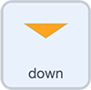

## Add control to buttons

Now let's code the arrow buttons to change the value of `repetitions`{:class="block3variables"} whenever the buttons are clicked.

--- task ---

Leaving the existing code as it is. Select a `when this sprite clicked`{:class="block3events"} block.

Add a `change repetitions by`{:class="block3variables"} variable block below which should have a value of `1`:


```blocks3
when this sprite clicked
change [repetitions v] by (1)
```

--- /task ---

Click the green flag to test that `repetitions`{:class="block3variables"} goes up each time you click it.

Keep going. Does `repetitions`{:class="block3variables"} stop going up?

You don't want the exercise repeating too many times, so let's add some code to stop `repetitions`{:class="block3variables"} going higher than 5.

--- task ---

From `Control`{:class="block3control"} select an `if... then... else...`{:class="block3control"} block, placing the `change repetitions by 1`{:class="block3variables"} in the space below `if... then`{:class="block3control"}:


```blocks3
when this sprite clicked
+ if <> then
    change [repetitions v] by (1)
else
+ end
```

--- /task ---

You are going to add the **condition** `if`{:class="block3control"} `repetitions`{:class="block3variables"} `is less than`{:class="block3operators"} `5`.

--- task ---

From `Operators`{:class="block3operators"}, select a `less than`{:class="block3operators"} operator:

```blocks3
[]<[] ::operators
```

Place the block in to the top space of the `if... then... else...`{:class="block3control"} block.

From `Variables`{:class="block3variables"}, select a rounded `repetitions`{:class="block3variables"} block and place it before the `<`{:class="block3operators"}. Type the number `5` after the `<`{:class="block3operators"}:


```blocks3
when this sprite clicked
if <(repetitions ::variables)<[5] ::operators +> then
    change [repetitions v] by (1)
else
end
```

--- /task ---

Now, `repetitions`{:class="block3variables"} should only go up `1` `if`{:class="block3control"} `repetitions`{:class="block3variables"} `is less than`{:class="block3operators"} `5`

What will happen if the user selects `repetitions`{:class="block3variables"} to be `5 or more`?

--- task ---

Add a `say`{:class="block3looks"} block with the message `5 repetitons is the maximum` for `2` seconds below the `else`{:class="block3control"}:


```blocks3
when this sprite clicked
if <(repetitions ::variables)<[5] ::operators> then
    change [repetitions v] by (1)
else
+     say [5 repetitions is the maximum] for (2) seconds
end
```

--- /task ---

Now you'll need to do the same for the **down arrow**, but using a different condition and **reducing** `repetitions`{:class="block3variables"} by 1 each time.

Note that a way to say **reduce by 1** in Scratch is, `change by`{:class="block3variables"} `-1`.

--- task ---

Select the **down arrow** sprite, add a `when this sprite clicked`{:class="block3events"} and an `if... then... else...`{:class="block3control"} block.

Add the **condition**, `if`{:class="block3control"} `repetitions`{:class="block3variables"} `is more than`{:class="block3operators"} `1`.

If the **condition** is **true**, `change repetitions by`{:class="block3variables"} `-1`

If the **condition** is **false**, `say`{:class="block3looks"} `Repetitions can't be lower than 1` for `2` seconds:



```blocks3
when this sprite clicked
if <(repetitions)>[1]> then
    change [repetitions v] by (-1)
else
    say [Repetitions can't be lower than 1] for (2) seconds
end
```

--- /task ---

Test the program by running it. Click the two arrows to raise or reduce the number of repetitions. 

Does `repetitions`{:class="block3variables"} stay between 1 and 5?

--- save ---
