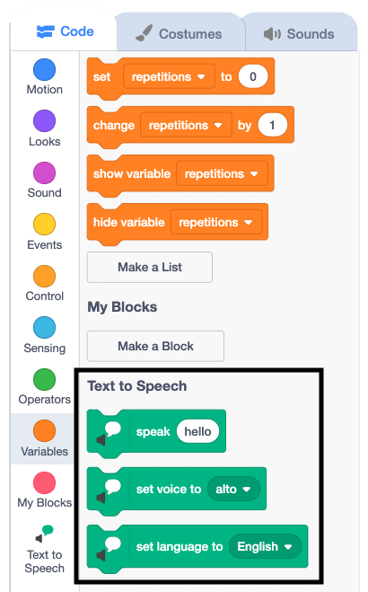

## Exercise 2

Now you can control the number of times each exercise repeats, it is time to add a second exercise routine.

--- task ---

Select your **Nadia** sprite and grab a `repeat`{:class="block3control"} loop.

Since you'll want this to repeat the same number of times as the existing exercise, add a rounded `repetitions`{:class="block3variables"} variable block into the empty field.


```blocks3
repeat (repetitions)
```

--- /task ---

--- task ---

For this exercise, you will use `text to speech`{:class="block3extensions"} instead of `say`{:class="block3looks"} so the exercise instructions will be said out loud by the computer.

Click on the extensions button in the bottom left of the Scratch window.


Choose the `Text to Speech`{:class="block3extensions"} extension.


A new set of `text to speech`{:class="block3extensions"} blocks will appear at the bottom of the existing block palettes.



--- /task ---

Next, you're ready to start adding the exercise instructions.

--- task ---

Add a `speak`{:class="block3extensions"} block from your new `text to speech`{:class="block3extensions"} blocks.

Set the text to `roll your neck to the right`.


```blocks3
repeat (repetitions)
speak [roll your neck to the right] :: extension
```

--- /task ---

--- task ---

Next, add a `Looks`{:class="block3looks"} block to `change the costume`{:class="block3looks"}.

Switch the costume to `head right`.


```blocks3
repeat (repetitions)
speak [roll your neck to the right] :: extension
switch costume to (head right v)
```

--- /task ---