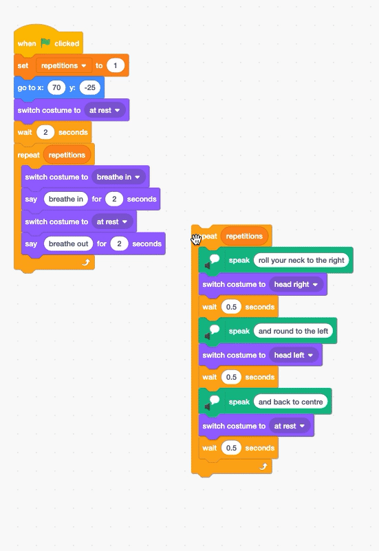

## Head roll

Now you can control the number of times each exercise repeats, it is time to add a second exercise routine.

--- task ---

For this exercise, you will use `text to speech`{:class="block3extensions"} instead of `say`{:class="block3looks"} so that the exercise instructions will be said out loud by the computer.

Click on the 'Choose an Extensions' button in the bottom left of the Scratch window.


Choose the `Text to Speech`{:class="block3extensions"} extension.


A new set of `Text to Speech`{:class="block3extensions"} blocks will appear.


--- /task ---

Next, you'll code the head roll exercise as a separate code _snippet_ which you'll add to your main code right at the end.

--- task ---

Select the **Nadia** sprite and grab a `repeat`{:class="block3control"} block.

Add a rounded `repetitions`{:class="block3variables"} variable block to control the number of repetitions.


```blocks3
repeat (repetitions)
```

--- /task ---

Now let's start adding the exercise instructions.

--- task ---

Add a `speak`{:class="block3extensions"} block from the new `Text to Speech`{:class="block3extensions"} blocks, setting the text to `roll your neck to the right`.

Next, add a `change costume`{:class="block3looks"} block and switch the costume to `head right`.

Lastly, add a short `wait`{:class="block3control"} block to the `text to speech`{:class="block3extensions"}. 


```blocks3
repeat (repetitions)
+     speak [roll your neck to the right] :: tts
+     switch costume to (head right v)
+     wait (0.5) seconds
end
```

--- /task ---

Each exercise step will use a `text to Speech`{:class="block3extensions"}, `switch costume`{:class="block3looks"} and `wait`{:class="control"} block.

--- task ---

Add the following `Text to Speech`{:class="block3extensions"} instruction: `and around to the left`.

`Switch the costume`{:class="block3looks"} to `head left` and `wait`{:class="control"} for half a second.


```blocks3

repeat (repetitions)
    speak [roll your neck to the right] :: tts
    switch costume to (head right v)
    wait (0.5) seconds
+     speak [and round to the left] :: tts
+     switch costume to (head left v)
+     wait (0.5) seconds
end
```

--- /task ---

And the last step of the exercise.

--- task ---

Type in the instruction, `and back to centre` .Then add `switch the costume`{:class="block3looks"} back to `at rest` and `wait`{:class="control"} for another 0.5 seconds.


```blocks3
repeat (repetitions)
    speak [roll your neck to the right] :: tts 
    switch costume to (head right v)
    wait (0.5) seconds
    speak [and round to the left] :: tts 
    switch costume to (head left v)
    wait (0.5) seconds
+     speak [and back to centre] :: tts 
+     switch costume to (at rest v)
+     wait (0.5) seconds
end
```

--- /task ---

--- task ---

Now add your new exercise routine to your exisiting code.



```blocks3
when flag clicked
set [repetitions v] to (3)
go to x: (70) y: (-25)
switch costume to (at rest v)
wait (2) seconds
repeat (repetitions ::variables)
    switch costume to (breathe in v)
    say [breathe in]  for (2) seconds
    switch costume to (at rest v)
    say [breathe out]  for (2) seconds
end
+ repeat (repetitions)
    speak [roll your neck to the right] :: tts 
    switch costume to (head right v)
    wait (0.5) seconds
    speak [and round to the left] :: tts 
    switch costume to (head left v)
    wait (0.5) seconds
    speak [and back to centre] :: tts 
    switch costume to (at rest v)
    wait (0.5) seconds
end
```

--- /task ---
