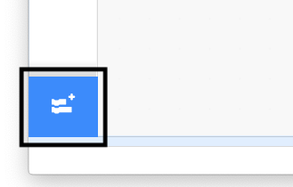

## Exercise 2

Now you can control the number of times each exercise repeats, it is time to add a second exercise routine.

--- task ---

Select your **Nadia** sprite and grab a `repeat`{:class="block3control"} loop.

Since you'll want this to repeat the same number of times as the existing exercise, add a rounded `repetitions`{:class="block3variables"} variable block into the empty field.


```blocks3
repeat (repetitions)
```

--- /task ---

--- task ---

For this exercise, you will use `text to speech`{:class="block3extensions"} instead of `say`{:class="block3looks"} so the exercise instructions will be said out loud by the computer.

Click on the extensions button in the bottom left of the Scratch window.



Choose the `Text to Speech`{:class="block3extensions"} extension.


A new set of `text to speech`{:class="block3extensions"} blocks will appear at the bottom of the existing block palettes.


--- /task ---

Next, you're ready to start adding the exercise instructions.

--- task ---

Add a `speak`{:class="block3extensions"} block from your new `text to speech`{:class="block3extensions"} blocks.

Set the text to `roll your neck to the right`.


```blocks3
repeat (repetitions)
+     speak [roll your neck to the right] :: extension
end
```

--- /task ---

--- task ---

Next, add a `Looks`{:class="block3looks"} block to `change the costume`{:class="block3looks"}.

Switch the costume to `head right`.


```blocks3
repeat (repetitions)
    speak [roll your neck to the right] :: tts
+     switch costume to (head right v)
end
```

--- /task ---

Since the `text to speech`{:class="block3extensions"} is read out more quickly than the `say`{:class="block3looks"} block which lasts 2 seconds, you'll need to add a short `wait`{:class="block3control"}.

--- task ---

Add a half second `wait`{:class="control"}.


```blocks3
repeat (repetitions)
    speak [roll your neck to the right] :: tts
    switch costume to (head right v)
+     wait (0.5) seconds
end
```

--- /task ---

These three blocks together; `text to speech`{:class="block3extensions"}, `switch costume`{:class="block3looks"} and `wait`{:class="control"}; will make each step of the exercise. Let's add the next step.

--- task ---

Add `text to speech`{:class="block3extensions"} instruction, `and around to the left`.

`Switch the costume`{:class="block3looks"} to `head left` and `wait`{:class="control"} for half a second.


```blocks3

repeat (repetitions)
    speak [roll your neck to the right] :: extension
    switch costume to (head right v)
    wait (0.5) seconds
+     speak [and round to the left] :: extension
+     switch costume to (head left v)
+     wait (0.5) seconds
end
```

--- /task ---

And the last step of the exercise.

--- task ---

Add the instruction, `and back to centre`, `switch the costume`{:class="block3looks"} back to `at rest` and `wait`{:class="control"} for another 0.5 seconds.


```blocks3
repeat (repetitions)
    speak [roll your neck to the right] :: extension
    switch costume to (head right v)
    wait (0.5) seconds
    speak [and round to the left] :: extension
    switch costume to (head left v)
    wait (0.5) seconds
+     speak [and back to centre] :: extension
+     switch costume to (at rest v)
+     wait (0.5) seconds
end
```

--- /task ---

--- task ---

Now join your new exercise routine to the code you already had.


```blocks3
when flag clicked
set [repetitions v] to (3)
go to x: (70) y: (-25)
switch costume to (at rest v)
wait (2) seconds
repeat (repetitions ::variables)
    switch costume to (breathe in v)
    say [breathe in]  for (2) seconds
    switch costume to (at rest v)
    say [breathe out]  for (2) seconds
end
+ repeat (repetitions)
    speak [roll your neck to the right] :: extension
    switch costume to (head right v)
    wait (0.5) seconds
    speak [and round to the left] :: extension
    switch costume to (head left v)
    wait (0.5) seconds
    speak [and back to centre] :: extension
    switch costume to (at rest v)
    wait (0.5) seconds
end
```

--- /task ---
