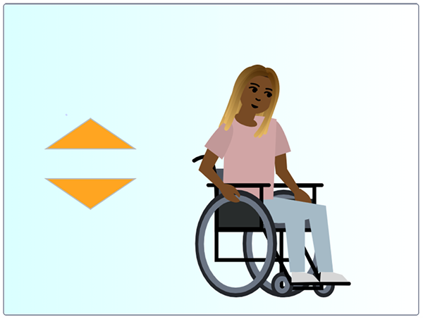
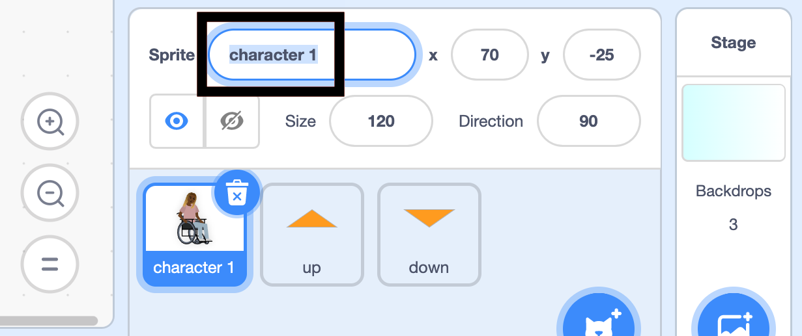

## अपना चरित्र तैयार करें

--- task ---

**ऑनलाइन **: Scratch में [स्टार्टर प्रोजेक्ट](http://rpf.io/relax-stretch-on){:target="_blank"} खोलें |

**ऑफ़लाइन:** Scratch के ऑफ़लाइन संपादक में [प्रोजेक्ट स्टार्टर फ़ाइल](http://rpf.io/p/en/relax-stretch-go){:target="_blank"} खोलें। यदि आपको ज़रूरत है तो, आप [यहां Scratch डाउनलोड और इंस्टॉल ](https://scratch.mit.edu/download){:target="_blank"} कर सकते हैं

आपको एक चरित्र स्प्राइट और दो तीर देखना चाहिए: ऊपर और नीचे।



--- /task ---

सबसे पहले, आप **character 1** को एक नाम देंगे।

--- task ---

**character 1** स्प्राइट का चयन करें।

Click on the **dialogue box** that shows the sprite's name. हमने इस स्प्राइट का नाम **Nadia** दिया है। `character 1` को अपनी पसंद के नाम से बदलें।



--- /task ---

इसके बाद, आप **Nadia** को स्टेज पर स्प्राइट सेटअप ब्लॉक जैसे `position`{:class="block3motion"} देंगे।

--- task ---

**Nadia** स्प्राइट अभी भी चयनित होने के साथ, `when green flag clicked`{:class="block3events"} जोड़ें ।

उसके नीचे एक `go to x: y:`{: class= "block3motion"} ब्लॉक जोड़ें जिसमें `x`{: class = "block3motion"} `70` पर सेट है और `y`{: class= "block3motion" `-25`पर सेट है।

`switch costume to`{:class="block3looks"} ब्लॉक जोड़ें, और कॉस्ट्यूम को `at rest`{:class="block3looks"} पर सेट करें

अंत में, `wait`{:class="block3control"} ब्लॉक जोड़ें और इसे `2` सेकंड पर सेट करें ताकि पहला अभ्यास अचानक शुरू न हो:


```blocks3
when flag clicked
go to x: (70) y: (-25)
switch costume to (at rest v)
wait (2) seconds
```

--- /task ---

--- save ---
