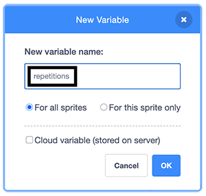

## दोहराव को नियंत्रित करें

अब, आप एक वेरिएबल बनाएंगे जो अंततः उपयोगकर्ता को प्रत्येक व्यायाम के दोहराव की संख्या को नियंत्रित करने की अनुमति देगा।

--- task ---

`Variable`{:class="block3variables"} ब्लॉक मेन्यू पर जाएं, **Make a Variable**पर क्लिक करें और इसे `repetitions`नाम दें।

{:width="200px"}

नया वेरिएबल अब `Variables`{:class="block3variables"} ब्लॉक मेन्यू में और स्टेज पर भी दिखाई देगा।

--- /task ---

अगला चरण प्रोग्राम शुरू होने पर `repetitions`{:class="block3variables"} का मान सेट करना है.

--- task ---

**Nadia** स्प्राइट चयनित होने पर, `set repetitions to`{:class="block3variables"} ब्लॉक जोड़ें और मान को `3`सेट करें:


```blocks3
when flag clicked
+ set [repetitions v] to (3)
go to x: (70) y: (-25)
switch costume to (at rest v)
wait (2) seconds
repeat (2)
    switch costume to (breathe in v)
    say [breathe in]  for (2) seconds
    switch costume to (at rest v)
    say [breathe out]  for (2) seconds
end
```

--- /task ---

अब, आप <`repetitions`{:class="block3variables"} का प्रयोग करेंगे ताकि यह नियंत्रित किया जा सके कि व्यायाम कितनी बार दोहराया जाएगा।

--- task ---

एक गोल `repetitions`{:class="block3variables"} ब्लॉक को `repeat`{:class="block3control"} ब्लॉक के मान के रूप में जोड़ें:


```blocks3
when flag clicked
set [repetitions v] to (3)
go to x: (70) y: (-25)
switch costume to (at rest v)
wait (2) seconds
repeat (repetitions ::variables +)
    switch costume to (breathe in v)
    say [breathe in]  for (2) seconds
    switch costume to (at rest v)
    say [breathe out]  for (2) seconds
end
```

--- /task ---

यह जाँचने के लिए कि यह प्रोग्राम काम करता है, आप `repetitions`{:class="block3variables"} के मान को बदल सकते हैं और प्रोग्राम को चला सकते हैं।

--- save ---
