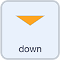

## बटन को कोड करें

अब, जब आप बटन क्लिक करते हैं, तो आप `repetitions`{:class="block3variables"} के मान को बदलने के लिए तीर बटनों को कोड करेंगे।

--- task ---

**up** स्प्राइट पर क्लिक करें। मौजूदा कोड को वैसे ही छोड़ दें। `when this sprite clicked`{:class="block3events"} ब्लॉक चुनें।

नीचे दिए गये `Variables`{:class="block3variables"} ब्लॉक मेनू में से `change repetitions by`{:class="block3variables"} जोड़ें। इसका मान `1`होना चाहिए:


```blocks3
when this sprite clicked
change [repetitions v] by (1)
```

--- /task ---

हरे झंडे पर क्लिक करें और `repetitions`{:class="block3variables"} ऊपर जाता है, जब भी आप **up** तीर पर क्लिक करते हैं।

आगे बढ़ते रहें क्या `repetitions`{:class="block3variables"} ऊपर जाना बंद कर देता है?

आप नहीं चाहते कि व्यायाम कई बार दोहराया जाए, इसलिए आगे, आप `repetitions`{:class="block3variables"} को 5 से ऊपर जाने से रोकने के लिए कुछ कोड जोड़ेंगे।

--- task ---

`Control`{:class="block3control"} ब्लॉक मेन्यू से, एक `if ... then ... else`{:class="block3control"} ब्लॉक चुनें, और `if ... then`{:class="block3control"}: के नीचे के स्थान में `change repetitions by 1`{:class="block3variables"} ब्लॉक रखें


```blocks3
when this sprite clicked
+ if <> then
    change [repetitions v] by (1)
else
+ end
```

--- /task ---

अब आप एक कंडीशन जोड़ देंगे, `if`{:class="block3control"} `repetitions`{:class="block3variables"} `is less than`{:class="block3operators"} `5`।

**नोट:** यह दोहराव की अधिकतम संख्या निर्धारित करता है। आप एक अलग संख्या चुन सकते हैं लेकिन आप जितना अधिक दोहराव की अनुमति देते हैं, प्रोग्राम को चलने में उतना ही अधिक समय लगता है।

--- task ---

`Operators`{:class="block3operators"} ब्लॉक मेनू से, एक`less than`{:class="block3operators"} ऑपरेटर का चयन करें:

```blocks3
[]<[] ::operators
```

ब्लॉक को `if ... then ... else`{:class="block3control"} ब्लॉक के उपर की जगह पर रखें, `if`{:class="block3control"} और `then`{:class="block3control"} के बीच में।

`Variables`{:class="block3variables"} ब्लॉक मेनू से, एक गोल `repetitions`{:class="block3variables"} ब्लॉक लें और इसे `<`{:class="block3operators"} से पहले रखें। `<`{:class="block3operators"} के बाद `5` नंबर टाइप करें:


```blocks3
when this sprite clicked
if <(repetitions ::variables)<[5] ::operators +> then
    change [repetitions v] by (1)
else
end
```

--- /task ---

अब, `repetitions`{:class="block3variables"} केवल `1` ऊपर जाना चाहिए यदि `if`{:class="block3control"} `repetitions`{:class="block3variables"} ``{:class="block3operators"} `5` से कम है ।

क्या होगा यदि उपयोगकर्ता `repetitions`{:class="block3variables"} को 5 या अधिक पर सेट करता है?

--- task ---

`else`{:class="block3control"} के नीचे, एक `say`{:class="block3looks"} ब्लॉक जोड़ें जो `2` सेकंड के लिए संदेश प्रदर्शित करेगा `5 repetitions is the maximum`


```blocks3
when this sprite clicked
if <(repetitions ::variables)<[5] ::operators> then
    change [repetitions v] by (1)
else
+     say [5 repetitions is the maximum] for (2) seconds
end
```

--- /task ---

**डाउन** तीर के लिए भी ऐसा ही करने की आवश्यकता है, लेकिन आपको एक अलग कंडीशन का उपयोग करने और `repetitions`{:class="block3variables"} को हर बार 1 से कम करने की आवश्यकता है।

Scratch में **reduce by 1** कहने का एक तरीका `change by`{:class="block3variables"} `-1` है

--- task ---

**down** स्प्राइट चुनें। एक `when this sprite clicked`{:class="block3events"} ब्लॉक जोड़ें और एक `if ... then ... else`{:class="block3control"} ब्लॉक ।

कंडीशन जोड़ें `if`{:class="block3control"} `repetitions`{:class="block3variables"} `is more than`{:class="block3operators"} `1`।

एक ब्लॉक जोड़ें ताकि यदि कंडीशन **true** है, तो आपका प्रोग्राम `change repetitions by`{:class="block3variables"} `-1` करेगा।

एक ब्लॉक जोड़ें ताकि यदि कंडीशन **false** है, तो आपका प्रोग्राम `say`{:class="block3looks"} `Repetitions can't be lower than 1` for `2` से कम नहीं हो सकता:



```blocks3
when this sprite clicked
if <(repetitions)>[1]> then
    change [repetitions v] by (-1)
else
    say [Repetitions can't be lower than 1] for (2) seconds
end
```

--- /task ---

इसका परीक्षण करने के लिए प्रोग्राम चलाएँ। दोहराव की संख्या बढ़ाने या घटाने के लिए दो तीरों पर क्लिक करें।

क्या `repetitions`{:class="block3variables"} 1 और 5 के बीच रहता है?

--- save ---
