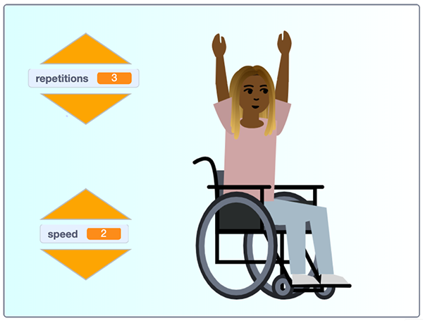

## और जोड़ें

शाबाश! आपने खुद को और दूसरों को चलता-फिरता रखने के लिए एक स्वस्थ 'आराम और अँगड़ाई लें' व्यायाम कार्यक्रम प्रोग्राम किया है।

आप अपने प्रोग्राम को कैसे सुधारना चाहेंगे?

एक नई व्यायाम दिनचर्या बनाने के लिए आप **Nadia** स्प्राइट की कुछ वेशभूषा का उपयोग कर सकते हैं जो वर्तमान में अप्रयुक्त हैं, या यहां तक कि एक मौजूदा पोशाक की नकल भी कर सकते हैं, और अपनी खुद की एक नई स्थिति पोशाक बनाने के लिए पोशाक को संपादित कर सकते हैं!

आप `say`{:class="block3looks"} या `Text to Speech`{:class="block3extensions"} ब्लॉक किसका का उपयोग करेंगे? यह पूरी तरह आप पर निर्भर है।

दिनचर्या की गति को बदलने वाले नियंत्रण जोड़ने के लिए आप एक नए `variable`{:class="block3variables"} का उपयोग कर सकते हैं `wait`{:class="block3control"} को नियंत्रित करने के लिए और निर्देशों को `say`{:class="block3looks"} के लिए कितना समय लगता है। आप गति को नियंत्रित करने के लिए और अधिक बटन बना सकते हैं, जैसे दोहराव की संख्या को नियंत्रित करने के लिए तीर।

--- no-print ---

  <iframe src="https://scratch.mit.edu/projects/403436186/embed" allowtransparency="true" width="485" height="402" frameborder="0" scrolling="no" allowfullscreen></iframe>

--- /no-print ---

--- print-only ---

--- /print-only ---
