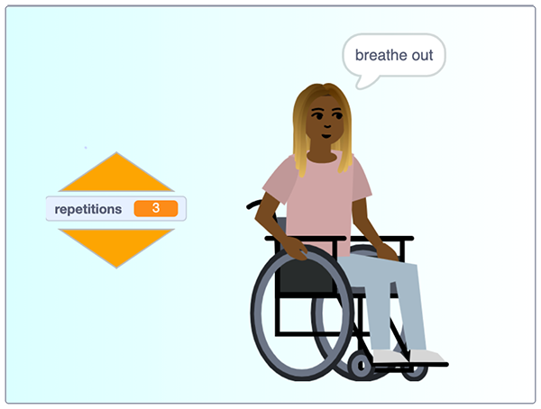

## ಪರಿಚಯ

ನೀವು ಕುಳಿತಿರುವಾಗ ಸೇರಿದಂತೆ ನಿಯಮಿತ ಮತ್ತು ವಿಶ್ರಾಂತಿಯ ವ್ಯಾಯಾಮಗಳನ್ನು ಮಾಡುವ ಮೂಲಕ ನಿಮ್ಮನ್ನು ನೀವು ಚಲನಾತ್ಮಕವಾಗಿ, ಹೊಂದಿಕೊಳ್ಳುವಂತೆ ಮತ್ತು ಚುರುಕಾಗಿ ಇರಿಸಿಕೊಳ್ಳಬಹುದು. ಕುಳಿತಿರುವಾಗ ನೀವು ಮತ್ತು ಇತರರು ಆರೋಗ್ಯವಾಗಿರಲು ಸಹಾಯ ಮಾಡಲು ಪ್ರೋಗ್ರಾಮ್‌ನ್ನು ಬರೆಯಿರಿ.

### ನೀವು ಏನು ಮಾಡುತ್ತೀರಿ

ಕುಳಿತಿರುವಾಗ ಮಾಡಬಹುದಾದ ಕೆಲವು ಜಾಗರೂಕ, ವಿಶ್ರಾಂತಿಯ ವ್ಯಾಯಾಮಗಳನ್ನು ಪ್ರದರ್ಶಿಸುವ ಪ್ರೋಗ್ರಾಮ್‌ನ್ನು ನೀವು ರಚಿಸುತ್ತೀರಿ, ಮತ್ತು ನಿಮ್ಮದೇ ಆದ ಹೊಸ ವ್ಯಾಯಾಮಗಳನ್ನೂ ಸಹ ಸೇರಿಸಬಹುದು.

--- no-print ---

ವ್ಯಾಯಾಮದ ದಿನಚರಿಯನ್ನು ಪ್ರಾರಂಭಿಸಲು ಹಸಿರು ಬಾವುಟದ ಮೇಲೆ ಕ್ಲಿಕ್‌ ಮಾಡಿ.

ಪ್ರತಿಯೊಂದು ವ್ಯಾಯಾಮ ಪುರಾವರ್ತನೆಯಾಗುವ ಸಂಖ್ಯೆಯನ್ನು ಬದಲಾಯಿಸಲು ಕಿತ್ತಳೆ ಬಣ್ಣದ **up** or **down** ಬಾಣಗಳ ಮೇಲೆ ಕ್ಲಿಕ್‌ ಮಾಡಿ.

  <iframe src="https://scratch.mit.edu/projects/405322095/embed" allowtransparency="true" width="485" height="402" frameborder="0" scrolling="no" allowfullscreen></iframe>

--- /no-print ---

--- print-only ---

--- /print-only ---

--- collapse ---
---
title: ನಿಮಗೆ ಬೇಕಾಗಿರುವುದು
---
### ಯಂತ್ರಾಂಶ (ಹಾರ್ಡ್ವೇರ್)

+ ಸ್ಕ್ರಾಚ್ ರನ್‌ ಮಾಡುವ ಸಾಮರ್ಥ್ಯವಿರುವ ಒಂದು ಕಂಪ್ಯೂಟರ್‌ ಅಥವಾ ಟ್ಯಾಬ್ಲೆಟ್

### ಸಾಫ್ಟ್ವೇರ್

+ Scratch 3 ([ಆನ್‌ಲೈನ್‌ನಲ್ಲಿ](https://scratch.mit.edu/){:target="_blank"} ಅಥವಾ [ಆಫ್‌ಲೈನ್ನಲ್ಲಿ](https://scratch.mit.edu/download){:target="_blank"})

### ಡೌನ್‌ಲೋಡ್‌ಗಳು

+ ನೀವು ಆಫ್‌ಲೈನ್‌ನಲ್ಲಿ ಕೆಲಸ ಮಾಡುತ್ತಿದ್ದರೆ, [ಪ್ರಾಜೆಕ್ಟ್‌ ಪ್ರಾರಂಭಿಕ ಫೈಲ್](https://rpf.io/p/en/relax-stretch-go){:target="_blank"} ಡೌನ್‌ಲೋಡ್‌ ಮಾಡಿಕೊಳ್ಳಿ

--- /collapse ---

--- collapse ---
---
title: ನೀವು ಏನು ಕಲಿಯುವಿರಿ
---

+ `variable`{:class="block3variables"} ನಿಯಂತ್ರಿಸಲು `condition`{:class="block3control"}ನ್ನು ಹೇಗೆ ಉಪಯೋಗಿಸುವುದು
+ `repetitions`{:class="block3control"} ಸಂಖ್ಯೆಗಳನ್ನು ನಿಯಂತ್ರಿಸಲು `variable`{:class="block3variables"}ನ್ನು ಹೇಗೆ ಉಪಯೋಗಿಸುವುದು
+ `Text to Speech`{:class="block3extensions"} ವಿಸ್ತರಣಾ ಬ್ಲಾಕ್‌ ಗಳನ್ನು ಹೇಗೆ ಉಪಯೋಗಿಸುವುದು

--- /collapse ---

--- collapse ---
---
title: ಶಿಕ್ಷಕರಿಗೆ ಹೆಚ್ಚುವರಿ ಮಾಹಿತಿ
---

ನೀವು [ಪೂರ್ಣಗೊಂಡ ಪ್ರಾಜೆಕ್ಟ್‌ನ್ನು ಇಲ್ಲಿ ಡೌನ್‌ಲೋಡ್‌ ](https://rpf.io/p/en/sit-stretch-get){:target="_blank"} ಮಾಡಿಕೊಳ್ಳಬಹುದು.

ನೀವು ಈ ಯೋಜನೆಯನ್ನು ಮುದ್ರಿಸಬೇಕಾದರೆ, ದಯವಿಟ್ಟು [ಮುದ್ರಕ-ಸ್ನೇಹಿ ಆವೃತ್ತಿಯನ್ನು](https://projects.raspberrypi.org/en/projects/sit-stretch/print){:target="_blank"} ಬಳಸಿರಿ.

--- /collapse ---
