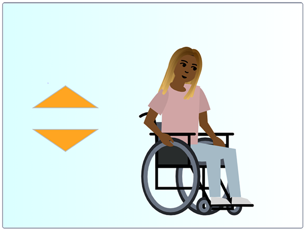

## ನಿಮ್ಮ ಪಾತ್ರವನ್ನು ಅಣಿಮಾಡಿ

--- task ---

**ಆನ್‌ಲೈನ್:** Scratch ನಲ್ಲಿ [ಪ್ರಾರಂಭಿಕ ಪ್ರಾಜೆಕ್ಟ್](http://rpf.io/relax-stretch-on){:target="_blank"} ತೆರೆಯಿರಿ.

**ಆಫ್‌ಲೈನ್:** Scratch ಆಫ್‌ಲೈನ್‌ ಎಡಿಟರ್‌ನಲ್ಲಿ [ಪ್ರಾರಂಭಿಕ ಪ್ರಾಜೆಕ್ಟ್ ಫೈಲ್](http://rpf.io/p/en/relax-stretch-go){:target="_blank"} ತೆರೆಯಿರಿ. ನಿಮಗೆ ಬೇಕಾದರೆ, ನೀವು [ಇಲ್ಲಿ Scratch ಡೌನ್‌ಲೋಡ್‌ ಮಾಡಿಕೊಂಡು ಇನ್‌ಸ್ಟಾಲ್‌ ಮಾಡಬಹುದು](https://scratch.mit.edu/download){:target="_blank"}.

ನೀವು ಸ್ಪ್ರೈಟ್‌ ಪಾತ್ರ ಮತ್ತು ಎರಡು ಬಾಣಗಳನ್ನು ನೋಡಬೇಕು: ಅಪ್‌ ಮತ್ತು ಡೌನ್.



--- /ಕಾರ್ಯ ---

ಮೊದಲಿಗೆ, ನೀವು **character 1** ಕ್ಕೆ ಹೆಸರು ಕೊಡುತ್ತೀರಿ.

--- task ---

**character 1** ಸ್ಪ್ರೈಟ್‌ ಆಯ್ಕೆ ಮಾಡಿಕೊಳ್ಳಿ.

ಸ್ಪ್ರೈಟ್‌ನ ಹೆಸರು ತೋರಿಸುವ **dialogue box** ಮೇಲೆ ಕ್ಲಿಕ್‌ ಮಾಡಿ. ನಾವು ಈ ಸ್ಪ್ರೈಟ್‌ನ್ನು **Nadia** ಎಂದು ಹೆಸರಿಸಿದ್ದೇವೆ. `character 1` ನ್ನು ನಿಮ್ಮ ಆಯ್ಕೆಯ ಹೆಸರಿನಿಂದ ಬದಲಾಯಿಸಿ.


--- /task ---

ನಂತರ, ನೀವು **Nadia** ಸ್ಪ್ರೈಟ್‌ಗೆ Stage ಮೇಲೆ `position`{:class="block3motion"} ಸೆಟ್‌ಅಪ್‌ ಬ್ಲಾಕ್‌ಗಳನ್ನು ಕೊಡುತ್ತೀರಿ.

--- ಕಾರ್ಯ ---

**Nadia** ಸ್ಪ್ರೈಟ್‌ ಇನ್ನೂ ಆಯ್ಕೆಯಾಗಿ ಇರುವಾಗ, `when green flag clicked`{:class="block3events"} ಬ್ಲಾಕ್‌ ಸೇರಿಸಿ.

ಅದರ ಕೆಳಗೆ, `go to x: y:`{:class="block3motion"} ಬ್ಲಾಕ್‌ನ್ನು `70` ಗೆ ಹೊಂದಿಸಿರುವ `x`{:class="block3motion"} ಮತ್ತು `-25`ಗೆ ಹೊಂದಿಸಿರುವ `y`{:class="block3motion"}ನೊಂದಿಗೆ ಸೇರಿಸಿ.

`switch costume to`{:class="block3looks"} ಬ್ಲಾಕ್‌ ಸೇರಿಸಿ ಮತ್ತು ಉಡುಪನ್ನು `at rest`{:class="block3looks"}ಗೆ ಹೊಂದಿಸಿ.

ಅಂತಿಮವಾಗಿ, `wait`{:class="block3control"} ಬ್ಲಾಕ್‌ನ್ನು ಸೇರಿಸಿ ಮತ್ತು ಅದನ್ನು `2` ಸೆಕೆಂಡುಗಳಿಗೆ ಹೊಂದಿಸಿ, ಅದರಿಂದ ಮೊದಲನೆಯ ವ್ಯಾಯಾಮ ತಕ್ಷಣ ಪ್ರಾರಂಭವಾಗುವುದಿಲ್ಲ:


```blocks3
when flag clicked
go to x: (70) y: (-25)
switch costume to (at rest v)
wait (2) seconds
```

--- /task ---

--- save ---
