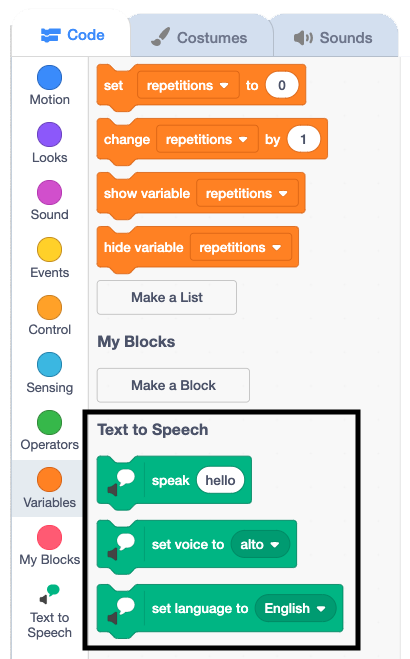

## ಕತ್ತು ತಿರುಗಿಸುವ ವ್ಯಾಯಾಮವನ್ನು ಸೇರಿಸಿ

ಈಗ ನೀವು ಪ್ರತಿಯೊಂದು ವ್ಯಾಯಾಮವು ಪುನರಾವರ್ತನೆಯಾಗುವ ಸಂಖ್ಯೆಯನ್ನು ನಿಯಂತ್ರಿಸಬಹುದಾದುದರಿಂದ, ಈಗ ಎರಡನೆಯ ವ್ಯಾಯಾಮದ ದಿನಚರಿ ಸೇರಿಸುವ ಸಮಯ.

--- task ---

ಈ ವ್ಯಾಯಾಮಕ್ಕೆ, ನೀವು `say`{:class="block3looks"}ಬದಲು `Text to Speech`{:class="block3extensions"} ಉಪಯೋಗಿಸುತ್ತೀರಿ, ಅದರಿಂದ ವ್ಯಾಯಾಮದ ಸೂಚನೆಗಳನ್ನು ಕಂಪ್ಯೂಟರ್‌ ಮಾತಿನರೂಪದಲ್ಲಿ ಹೇಳುತ್ತದೆ.

Scratch ವಿಂಡೋದ ಕೆಳ ಎಡಭಾಗದ ಮೂಲೆಯಲ್ಲಿರುವ **Add Extension** ಬಟನ್‌ ಕ್ಲಿಕ್‌ ಮಾಡಿ.


**Text to Speech** ವಿಸ್ತರಣೆ ಆಯ್ಕೆ ಮಾಡಿಕೊಳ್ಳಿ.


`Text to Speech`{:class="block3extensions"} ಬ್ಲಾಕ್‌ಗಳ ಹೊಸ ಸೆಟ್‌ ಕಾಣಿಸುತ್ತದೆ.



--- /task ---

ನಂತರ, ಕುತ್ತಿಗೆ ತಿರುಗಿಸುವ ವ್ಯಾಯಾಮವನ್ನು ಪ್ರತ್ಯೇಕ ಬ್ಲಾಕ್‌ ಕೋಡ್‌ ಆಗಿ ರಚಿಸುತ್ತೀರಿ, ಅದನ್ನು ನೀವು ನಿಮ್ಮ ಮುಖ್ಯ ಕೋಡ್‌ಗೆ ಕೊನೆಯಲ್ಲಿ ಸೇರಿಸುತ್ತೀರಿ.

--- task ---

**Nadia** ಸ್ಪ್ರೈಟ್‌ ಆಯ್ದುಕೊಳ್ಳಿ ಮತ್ತು `repeat`{:class="block3control"} ಬ್ಲಾಕ್‌ ಆಯ್ಕೆಮಾಡಿಕೊಳ್ಳಿ.

ಪುನರಾವರ್ತನೆಗಳ ಸಂಖ್ಯೆಯನ್ನು ನಿಯಂತ್ರಿಸಲು `Variables`{:class="block3variables"} ಬ್ಲಾಕ್‌ಗಳ ಮೆನುನಿಂದ ಪೂರ್ಣಾಂಕ `repetitions`{:class="block3variables"} ಬ್ಲಾಕ್‌ನ್ನು ಸೇರಿಸಿ:


```blocks3
repeat (repetitions)
```

--- /ಕಾರ್ಯ ---

ಈಗ, ನೀವು ವ್ಯಾಯಾಮದ ಸೂಚನೆಗಳನ್ನು ಸೇರಿಸಲು ಪ್ರಾರಂಭಿಸುತ್ತೀರಿ.

--- task ---

`Text to Speech`{:class="block3extensions"} ಬ್ಲಾಕ್‌ಗಳ ಮೆನುನಿಂದ, `speak`{:class="block3extensions"} ಬ್ಲಾಕ್‌ ಸೇರಿಸಿ ಮತ್ತು `roll your neck to the right` ಪಠ್ಯವನ್ನು ಟೈಪ್‌ ಮಾಡಿ.

ನಂತರ, `switch costume to`{:class="block3looks"} ಬ್ಲಾಕ್‌ ಸೇರಿಸಿ ಮತ್ತು `head right`{:class="block3looks"} ಉಡುಪನ್ನು ಆಯ್ಕೆಮಾಡಿಕೊಳ್ಳಿ.

ಅಂತಿಮವಾಗಿ, `wait`{:class="block3control"} ಚಿಕ್ಕ ಬ್ಲಾಕ್‌ನ್ನು ಸೇರಿಸಿ:


```blocks3
repeat (repetitions)
+     speak [roll your neck to the right] :: tts
+     switch costume to (head right v)
+     wait (0.5) seconds
end
```

--- /task ---

ವ್ಯಾಯಾಮದ ಪ್ರತಿಯೊಂದು ಹಂತಕ್ಕೆ `Text to Speech`{:class="block3extensions"}, `switch costume to`{:class="block3looks"}, ಮತ್ತು `wait`{:class="block3control"} ಬ್ಲಾಕ್‌ಗಳು ಬೇಕು.

--- task ---

ಈ ಕೆಳಗಿನ `Text to Speech`{:class="block3extensions"} ಸೂಚನೆಗಳನ್ನು ಸೇರಿಸಿ: `and round to the left`.

ಬ್ಲಾಕ್‌ಗಳನ್ನು ಸೇರಿಸಿ, ಅದರಿಂದ **Nadia** ಸ್ಪ್ರೈಟ್ `switch costume to`{:class="block3looks"} `head left`{:class="block3looks"} ಮತ್ತು `wait`{:class="block3control"} `0.5` ಸೆಕೆಂಡುಗಳವರೆಗೆ ಮಾಡುತ್ತದೆ:


```blocks3

repeat (repetitions)
    speak [roll your neck to the right] :: tts
    switch costume to (head right v)
    wait (0.5) seconds
+     speak [and round to the left] :: tts
+     switch costume to (head left v)
+     wait (0.5) seconds
end
```

--- /task ---

ಈಗ, ನೀವು ವ್ಯಾಯಾಮದ ಕೊನೆಯ ಹಂತವನ್ನು ಸೇರಿಸುತ್ತೀರಿ.

--- task ---

`and back to centre` ಸೂಚನೆಯನ್ನು ಟೈಪ್‌ ಮಾಡಿ. ನಂತರ, `switch costume to`{:class="block3looks"} ಬ್ಲಾಕ್‌ ಸೇರಿಸಿ ಮತ್ತು ಅದನ್ನು ಮತ್ತೆ `at rest`{:class="block3looks"}ಗೆ ಹೊಂದಿಸಿ, ನಂತರ ಅದನ್ನು `wait`{:class="block3control"} ಇನ್ನೂ `0.5` ಸೇಕೆಂಡುಗಳವರೆಗೆ ಹೊಂದಿಸಿ:


```blocks3
repeat (repetitions)
    speak [roll your neck to the right] :: tts 
    switch costume to (head right v)
    wait (0.5) seconds
    speak [and round to the left] :: tts 
    switch costume to (head left v)
    wait (0.5) seconds
+     speak [and back to centre] :: tts 
+     switch costume to (at rest v)
+     wait (0.5) seconds
end
```

--- /task ---

--- task ---

ಈಗ, ಅಸ್ತಿತ್ವದಲ್ಲಿರುವ ನಿಮ್ಮ ಕೋಡ್‌ಗೆ ನಿಮ್ಮ ಹೊಸ ವ್ಯಾಯಾಮದ ದಿನಚರಿಯನ್ನು ಸೇರಿಸಿ:

--- no-print ---


--- /no-print ---

--- print-only ---

```blocks3
when flag clicked
set [repetitions v] to (3)
go to x: (70) y: (-25)
switch costume to (at rest v)
wait (2) seconds
repeat (repetitions ::variables)
    switch costume to (breathe in v)
    say [breathe in]  for (2) seconds
    switch costume to (at rest v)
    say [breathe out]  for (2) seconds
end
+ repeat (repetitions)
    speak [roll your neck to the right] :: tts 
    switch costume to (head right v)
    wait (0.5) seconds
    speak [and round to the left] :: tts 
    switch costume to (head left v)
    wait (0.5) seconds
    speak [and back to centre] :: tts 
    switch costume to (at rest v)
    wait (0.5) seconds
end
```

--- /print-only ---

--- /task ---

--- save ---
