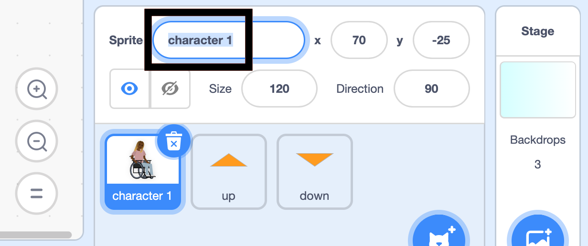
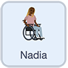

## तुमचे कॅरेक्टर तयार करा

--- task ---

**ऑनलाईन:** Scratch मधील [स्टार्टर प्रोजेक्ट](http://rpf.io/relax-stretch-on){:target="_blank"} उघडा.

**ऑफलाईन:** Scratch ऑफलाईन एडिटर मध्ये [ प्रोजेक्ट स्टार्टर फाईल](http://rpf.io/p/en/relax-stretch-go){:target="_blank"} उघडा. तुम्हाला आवश्यक असल्यास, तुम्ही [येथे Scratch डाऊनलोड आणि इंस्टॉल करू शकता](https://scratch.mit.edu/download){:target="_blank"}.

तुम्हाला कॅरेक्टर स्प्राईट आणि दोन ऍरोः वर आणि खाली दिसायला हवे.


--- /task ---

प्रथम, तुम्ही **character 1** ला नाव द्याल.

--- task ---

**character 1** sprite निवडा.

स्प्राईटचे नाव दाखवणाऱ्या **डायलॉग बॉक्स** वर क्लिक करा. तुम्ही या sprite ला **Nadia** असे नाव दिलेत. तुमच्या आवडीच्या नावाने `character 1` बदला.



--- /task ---

पुढे, तुम्ही **Nadia** sprite सेटअप ब्लॉक्स द्याल जसेकी Stage वर `position`{:class="block3motion"}.

--- task ---

अजुनही **Nadia** sprite निवडलेले असतांनाच, `when green flag clicked`{:class="block3events"} ब्लॉक जोडा.

त्याखाली, `x`{:class="block3motion"} हे `70` ला सेट करून आणि `y`{:class="block3motion"} हे `-25` ला सेट करून `go to x: y:`{:class="block3motion"} ब्लॉक जोडा.

`switch costume to`{:class="block3looks"} ब्लॉक जोडा, आणि कॉश्चुम `at rest`{:class="block3looks"} ला सेट करा.

शेवटी, `wait`{:class="block3control"} ब्लॉक जोडा आणि तो `2` सेकंदला जोडा जेणेकरून अचानकपणे पहिला व्यायाम चालू होणार नाही:



```blocks3
when flag clicked
go to x: (70) y: (-25)
switch costume to (at rest v)
wait (2) seconds
```

--- /task ---

--- save ---
