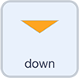

## बटन कोड करा

आता, तुम्ही बटन क्लिक केल्यावर `repetitions`{:class="block3variables"} ची व्हॅल्यू बदलण्यासाठी ऍरो बटनला कोड कराल.

--- task ---

**up** sprite वर क्लिक करा. आधीचा कोड तसाच राहू द्या. `when this sprite clicked`{:class="block3events"} ब्लॉक निवडा.

खालील `Variables`{:class="block3variables"} ब्लॉक मेनूमधून `change repetitions by`{:class="block3variables"} ब्लॉक जोडा. याची व्हॅल्यू `1` असावी:


```blocks3
when this sprite clicked
change [repetitions v] by (1)
```

--- /task ---

हिरव्या झेंड्यावर क्लिक करा आणि प्रत्येक वेळी तुम्ही **up** ऍरोवर क्लिक केल्यावर `repetitions`{:class="block3variables"} होते का ते तपासा.

चालू ठेवा. `repetitions`{:class="block3variables"} वर जाणे थांबले का?

तुम्हाला फार वेळेस व्यायाम पुन्हा करायचा नाही आहे, त्यामुळे पुढे, तुम्ही 5 च्या वर जाण्यापासून `repetitions`{:class="block3variables"} थांबविण्यासाठी काही कोड जोडाल.

--- task ---

`Control`{:class="block3control"} ब्लॉक मेनूमधून, `if ... then ... else`{:class="block3control"} ब्लॉक निवडा, आणि `change repetitions by 1`{:class="block3variables"} ब्लॉक `if ... then`{:class="block3control"} च्या खालील जागेत ठेवा:


```blocks3
when this sprite clicked
+ if <> then
    change [repetitions v] by (1)
else
+ end
```

--- /task ---

आता, तुम्ही स्थिती जोडाल `if`{:class="block3control"} `repetitions`{:class="block3variables"} `is less than`{:class="block3operators"} `5`.

**नोंद घ्या:** या सेटला पुनरावृत्तीची अधिकतम संख्या आहे. तुम्ही वेगळी संख्या निवडू शकता परंतु तुम्ही जितक्या जास्त पुनरावृत्तींना परवानगी द्याल तितका प्रोग्राम चालण्यास जास्त वेळ लागेल.

--- task ---

`Operators`{:class="block3operators"} ब्लॉक मेनूमधून, `less than`{:class="block3operators"} ऑपरेटर निवडा:

```blocks3
[]<[] ::operators
```

`if ... then ... else`{:class="block3control"} ब्लॉकच्या वरच्या जागेत, `if`{:class="block3control"} आणि `then`{:class="block3control"} दरम्यान ब्लॉक ठेवा.

`Variables`{:class="block3variables"} ब्लॉक मेनूमधून, गोलाकार `repetitions`{:class="block3variables"} ब्लॉक घ्या आणि तो `<`{:class="block3operators"} च्या आधी ठेवा. `<`{:class="block3operators"} नंतर `5` संख्या टाईप करा:


```blocks3
when this sprite clicked
if <(repetitions ::variables)<[5] ::operators +> then
    change [repetitions v] by (1)
else
end
```

--- /task ---

आता, `repetitions`{:class="block3variables"}केवळ याने up व्हायला हवे `1` `if`{:class="block3control"} `repetitions`{:class="block3variables"} `is less than`{:class="block3operators"} `5`.

यूजरने `repetitions`{:class="block3variables"} 5 किंवा अधिक सेट केल्यास काय घडेल?

--- task ---

`else`{:class="block3control"} च्या खाली, `say`{:class="block3looks"} ब्लॉक जोडा जो मेसेज दाखवेल की, `5 repetitions is the maximum` `2` सेकंदांसाठी आहे:


```blocks3
when this sprite clicked
if <(repetitions ::variables)<[5] ::operators> then
    change [repetitions v] by (1)
else
+     say [5 repetitions is the maximum] for (2) seconds
end
```

--- /task ---

आता, तुम्ही हेच **down** ऍरोबद्दल करायला हवे, तुम्ही प्रत्येक वेळी 1 ने `repetitions`{:class="block3variables"} कमी करण्यासाठी वेगवेगळ्या स्थितीचा वापर करायला हवा.

Scratch मध्ये **reduce by 1** म्हणण्याचा एक मार्ग म्हणजे `change by`{:class="block3variables"} `-1`.

--- task ---

**down** sprite निवडा. `when this sprite clicked`{:class="block3events"} ब्लॉक आणि `if ... then ... else`{:class="block3control"} ब्लॉक जोडा.

स्थिती जोडा `if`{:class="block3control"} `repetitions`{:class="block3variables"} `is more than`{:class="block3operators"} `1`.

ब्लॉक जोडा जेणेकरून स्थिती **बरोबर** असल्यास, तुमचा प्रोग्राम `change repetitions by`{:class="block3variables"} `-1`.

ब्लॉक जोडा जेणेकरून स्थिती **चूक** असल्यास, तुमचा प्रोग्राम `say`{:class="block3looks"} `Repetitions can't be lower than 1` `2` सेकंदांसाठी:



```blocks3
when this sprite clicked
if <(repetitions)>[1]> then
    change [repetitions v] by (-1)
else
    say [Repetitions can't be lower than 1] for (2) seconds
end
```

--- /task ---

प्रोग्रामची चाचणी घेण्यासाठी तो रन करा. पुनरावृत्तीची संख्या वाढविण्यासाठी किंवा कमी कऱण्यासाठी दोन ऍरोवर क्लिक करा.

`repetitions`{:class="block3variables"} 1 आणि 5 दरम्यान आहेत का?

--- save ---
