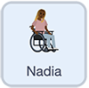
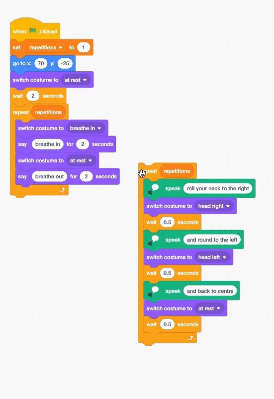

## हेड रोल व्यायाम जोडा

आता तुम्ही प्रत्येक व्यायामाची पुनरावृत्ती किती व्हावी ती संख्या नियंत्रित करू शकता, आता दुसरा व्यायाम रूटीन जोडण्याची वेळ आली आहे.

--- task ---

या व्यायामासाठी, तुम्ही `say`{:class="block3looks"} ऐवजी `Text to Speech`{:class="block3extensions"} वापराल जेणेकरून व्यायामाच्या सूचना कंप्युटरकडून बोलल्या जातील.

Scratch विंडोच्या डाव्या कोपऱ्यातील **Add Extension** बटनवर क्लिक करा.


**Text to Speech** एक्सटेंशन निवडा.


`Text to Speech`{:class="block3extensions"} ब्लॉक्सचा नवीन सेट दिसेल.


--- /task ---

पुढे, तुम्ही कोडचा एक वेगळा ब्लॉक म्हणून हेड रोल व्यायाम तयार कराल, जो तुम्ही शेवटी तुमच्या मुख्य कोडमध्ये जोडाल.

--- task ---

**Nadia** स्प्राईट निवडा आणि `repeat`{:class="block3control"} ब्लॉक निवडा.

पुनरावृत्तीची संख्या नियंत्रीत करण्यासाठी `Variables`{:class="block3variables"} ब्लॉक मधून गोलाकार `repetitions`{:class="block3variables"} ब्लॉक जोडा:



```blocks3
repeat (repetitions)
```

--- /task ---

आता, तुम्ही व्यायामाच्या सूचना जोडण्यास सुरुवात कराल.

--- task ---

`Text to Speech`{:class="block3extensions"} ब्लॉक्स मेनूमधुन, `speak`{:class="block3extensions"} ब्लॉक जोडा आणि `roll your neck to the right` या टेक्स्टमध्ये टाईप करा.

पुढे, `switch costume to`{:class="block3looks"} ब्लॉक जोडा आणि `head right`{:class="block3looks"} कॉश्चुम निवडा.

शेवटी, छोटा `wait`{:class="block3control"} ब्लॉक जोडा:


```blocks3
repeat (repetitions)
+     speak [roll your neck to the right] :: tts
+     switch costume to (head right v)
+     wait (0.5) seconds
end
```

--- /task ---

प्रत्येक व्यायामाच्या टप्प्याला आवश्यक असेल `Text to Speech`{:class="block3extensions"}, `switch costume to`{:class="block3looks"}, आणि `wait`{:class="block3control"} ब्लॉक्स.

--- task ---

खालील `Text to Speech`{:class="block3extensions"} सूचना जोडा: `and round to the left.

ब्लॉक्स जोडा जेणेकरून तुमचा **Nadia** स्प्राईट हा `switch costume to`{:class="block3looks"} `head left`{:class="block3looks"} आणि `wait`{:class="block3control"} `0.5` सेकंदांसाठी:


```blocks3

repeat (repetitions)
    speak [roll your neck to the right] :: tts
    switch costume to (head right v)
    wait (0.5) seconds
+     speak [and round to the left] :: tts
+     switch costume to (head left v)
+     wait (0.5) seconds
end
```

--- /task ---

आता, तुम्ही व्यायामाचा शेवटचा टप्पा जोडाल.

--- task ---

सूचनेमध्ये टाईप करा `and back to centre`. त्यानंतर, `switch costume to`{:class="block3looks"} ब्लॉक जोडा आणि तो पुन्हा `at rest`{:class="block3looks"} ला सेट करा, त्यानंतर दुसऱ्या `0.5` सेकंदांसाठी तो सेट करा `wait`{:class="block3control"}:


```blocks3
repeat (repetitions)
    speak [roll your neck to the right] :: tts 
    switch costume to (head right v)
    wait (0.5) seconds
    speak [and round to the left] :: tts 
    switch costume to (head left v)
    wait (0.5) seconds
+     speak [and back to centre] :: tts 
+     switch costume to (at rest v)
+     wait (0.5) seconds
end
```

--- /task ---

--- task ---

आता, तुमच्या आधीच्या कोडमध्ये तुमच्या नवीन व्यायामाचे रूटीन जोडा:

--- no-print ---



--- /no-print ---

--- print-only ---

```blocks3
when flag clicked
set [repetitions v] to (3)
go to x: (70) y: (-25)
switch costume to (at rest v)
wait (2) seconds
repeat (repetitions ::variables)
    switch costume to (breathe in v)
    say [breathe in]  for (2) seconds
    switch costume to (at rest v)
    say [breathe out]  for (2) seconds
end
+ repeat (repetitions)
    speak [roll your neck to the right] :: tts 
    switch costume to (head right v)
    wait (0.5) seconds
    speak [and round to the left] :: tts 
    switch costume to (head left v)
    wait (0.5) seconds
    speak [and back to centre] :: tts 
    switch costume to (at rest v)
    wait (0.5) seconds
end
```

--- /print-only ---

--- /task ---

--- save ---
