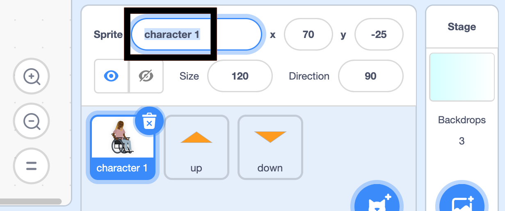

## మీ కారెక్టర్ ను సిద్ధం చేసుకోండి

--- task ---

**Online:** Scratch లో [స్టార్టర్ ప్రాజెక్ట్ ](http://rpf.io/relax-stretch-on){:target="_blank"} ని తెరవండి.

**Offline:** Scratch యొక్క ఆఫ్ లైన్ ఎడిటర్ లో [ప్రాజెక్టు స్టార్టర్ ఫైల్](http://rpf.io/p/en/relax-stretch-go){:target="_blank"} ని తెరవండి. మీకు అవసరమైతే, మీరు [ఇక్కడ Scratch ను డౌన్ లోడ్ చేసి ఇన్‌స్టాల్ చేయవచ్చు.](https://scratch.mit.edu/download){:target="_blank"}.

మీరు ఒక క్యారెక్టర్ sprite మరియు పైకి క్రిందికి: రెండు బాణపు గుర్తులను చూడవచ్చు.


--- /task ---

ముందుగా, మీరు **character 1** కి పేరు ఇస్తారు.

--- task ---

**character 1** sprite ని ఎంచుకోండి.

Sprite పేరును చూపే **dialogue box** పై క్లిక్ చేయండి. మనము ఈ sprite కి **Nadia** అని పేరు పెట్టాము. `character 1` ను మీరు ఎంచుకొన్న పేరుతో భర్తీ చేయండి.



--- /task ---

తర్వాత, మీరు **Nadia**sprite కి `position`{:class="block3motion"} వంటి సెటప్ బ్లాక్‌లను ఇస్తారు.

--- task ---

ఇప్పటికీ ఎంచుకున్న **Nadia** sprite తో, `when green flag clicked`{:class="block3events"} బ్లాక్‌ని జోడించండి.

ఆ క్రింద, `go to x: y:`{: class = "block3motion"} బ్లాక్ ను `x`{: class = "block3motion"} విలువ `70` మరియు `y`{: class = "block3motion"} విలువ `-25`కి సెట్ చేసి జోడించండి.

`switch costume to`{:class="block3looks"} బ్లాక్‌ ని జోడించి, కాస్ట్యూమ్‌ను `at rest`{:class="block3looks"} కి సెట్ చేయండి.

చివరగా, `wait`{:class="block3control"} బ్లాక్‌ని జోడించి, దానిని `2` సెకన్లకు సెట్ చేయండి, తద్వారా మొదటి వ్యాయామం అకస్మాత్తుగా ప్రారంభించబడదు:


```blocks3
when flag clicked
go to x: (70) y: (-25)
switch costume to (at rest v)
wait (2) seconds
```

--- /task ---

--- save ---
