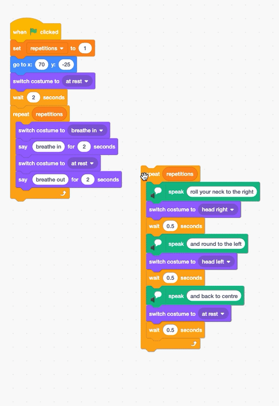

## హెడ్ రోల్ వ్యాయామాన్ని జోడించండి

ఇప్పుడు మీరు ప్రతి వ్యాయామం పునరావృతమయ్యే సంఖ్యను నియంత్రించగలరు, కాబట్ది ఇప్పుడు రెండవ వ్యాయామ దినచర్యను జోడించాల్సిన సమయం.

--- task ---

ఈ వ్యాయామం కోసం, మీరు `say`{:class="block3looks"} కి బదులుగా `Text to Speech`{:class="block3extensions"}ని ఉపయోగిస్తారు, తద్వారా వ్యాయామ సూచనలు కంప్యూటర్ ద్వారా మాట్లాడబడతాయి.

Scratch విండో యొక్క దిగువ ఎడమ మూలలో ఉన్న **Add Extension** బటన్ ని క్లిక్ చేయండి.


**Text to Speech** పొడిగింపును ఎంచుకోండి.


`Text to Speech`{:class="block3extensions"} బ్లాక్‌ల కొత్త సెట్ కనిపిస్తుంది.


--- /task ---

తర్వాత, మీరు హెడ్ రోల్ ఎక్సర్‌సైజ్‌ని ప్రత్యేక కోడ్ బ్లాక్‌గా క్రియేట్ చేస్తారు, మీరు చివర్లో దానిని మీ ప్రధాన కోడ్‌కి జోడిస్తారు.

--- task ---

**Nadia** sprite ని ఎంచుకోండి మరియు `repeat`{:class="block3control"} బ్లాక్‌ని ఎంచుకోండి.

Repetitions నియంత్రించడానికి, `Variables`{:class="block3variables"} బ్లాక్‌ల మెను నుంచి, రౌండెడ్ `repetitions`{:class="block3variables"} బ్లాక్ ని జోడించండి:


```blocks3
repeat (repetitions)
```

--- /task ---

ఇప్పుడు, మీరు వ్యాయామ సూచనలను జోడించడం ప్రారంభిస్తారు.

--- task ---

`Text to Speech`{:class="block3extensions"} బ్లాక్‌ల మెను నుండి, `speak`{:class="block3extensions"} బ్లాక్‌ని జోడించి, `roll your neck to the right`కి అని టైప్ చేయండి.

తర్వాత, `switch costume to`{:class="block3looks"} బ్లాక్‌ ని జోడించండి మరియు `head right`{:class="block3looks"} costume ని ఎంచుకోండి.

చివరగా, చిన్న `wait`{:class="block3control"} బ్లాక్‌ని జోడించండి:


```blocks3
repeat (repetitions)
+     speak [roll your neck to the right] :: tts
+     switch costume to (head right v)
+     wait (0.5) seconds
end
```

--- /task ---

ప్రతి వ్యాయామ దశకు `Text to Speech`{:class="block3extensions"}, `switch costume to`{:class="block3looks"} మరియు `wait`{:class="block3control"} బ్లాక్‌లు అవసరం.

--- task ---

కింది `Text to Speech`{:class="block3extensions"} సూచనను జోడించండి: `and round to the left`.

మీ **Nadia** sprite `switch costume to`{:class="block3looks"} ద్వారా `head left`{:class="block3looks"}కి మార్చేలా మరియు `0.5` సెకన్లు `wait`{:class="block3control"} చేసేలా బ్లాక్‌లను జోడించండి:


```blocks3

repeat (repetitions)
    speak [roll your neck to the right] :: tts
    switch costume to (head right v)
    wait (0.5) seconds
+     speak [and round to the left] :: tts
+     switch costume to (head left v)
+     wait (0.5) seconds
end
```

--- /task ---

ఇప్పుడు, మీరు వ్యాయామం యొక్క చివరి దశను జోడిస్తారు.

--- task ---

`and back to centre` సూచనని అమలు చేయండి. తర్వాత,`switch costume to`{:class="block3looks"} బ్లాక్‌ని జోడించండి. మరియు `at rest`{:class="block3looks"} కి తిరిగి సెట్ చేయండి, ఆపై దానిని మరో `0.5` సెకన్లు: `wait`{:class="block3control"} కి సెట్ చేయండి:


```blocks3
repeat (repetitions)
    speak [roll your neck to the right] :: tts 
    switch costume to (head right v)
    wait (0.5) seconds
    speak [and round to the left] :: tts 
    switch costume to (head left v)
    wait (0.5) seconds
+     speak [and back to centre] :: tts 
+     switch costume to (at rest v)
+     wait (0.5) seconds
end
```

--- /task ---

--- task ---

ఇప్పుడు, మీ ప్రస్తుత కోడ్‌కి మీ కొత్త వ్యాయామ దినచర్యను జోడించండి:

--- no-print ---



--- /no-print ---

--- print-only ---

```blocks3
when flag clicked
set [repetitions v] to (3)
go to x: (70) y: (-25)
switch costume to (at rest v)
wait (2) seconds
repeat (repetitions ::variables)
    switch costume to (breathe in v)
    say [breathe in]  for (2) seconds
    switch costume to (at rest v)
    say [breathe out]  for (2) seconds
end
+ repeat (repetitions)
    speak [roll your neck to the right] :: tts 
    switch costume to (head right v)
    wait (0.5) seconds
    speak [and round to the left] :: tts 
    switch costume to (head left v)
    wait (0.5) seconds
    speak [and back to centre] :: tts 
    switch costume to (at rest v)
    wait (0.5) seconds
end
```

--- /print-only ---

--- /task ---

--- save ---
