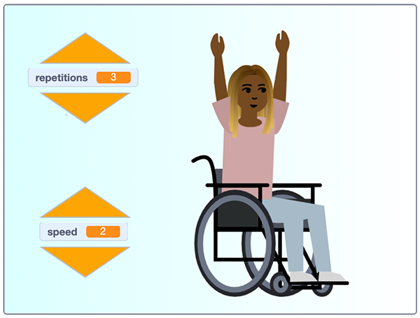

## మరిన్ని జోడించండి

బాగా చేసారు! మిమ్మల్ని మరియు ఇతరులను కదిలేలా చేయడానికి మీరు ఆరోగ్యకరమైన 'రిలాక్స్ అండ్ స్ట్రెచ్' వ్యాయామ కార్యక్రమాన్ని ప్రోగ్రామ్ చేసారు.

మీరు మీ ప్రోగ్రామ్‌ను ఎలా మెరుగుపరచాలనుకుంటున్నారు?

కొత్త వ్యాయామ దినచర్యను **Nadia** sprite costume లలో కొన్నింటిని ఉపయోగించవచ్చు లేదా ఇప్పటికే ఉన్న costumeని డూప్లికేట్ చేయవచ్చు మరియు మీ స్వంతంగా కొత్త పొజిషన్ costumeను తయారు చేసుకోవడానికి costume లను సవరించవచ్చు!

మీరు `say`{:class="block3looks"} బ్లాక్‌ని ఉపయోగిస్తారా? లేదా `Text to Speech`{:class="block3extensions"} బ్లాక్‌ని ఉపయోగిస్తారా? ఇది పూర్తిగా మీ ఇష్టం.

రొటీన్‌ల వేగాన్ని మార్చే నియంత్రణలను జోడించడానికి మీరు `wait`{:class="block3control"} సమయం మరియు ఎంత సమయం తీపుకొంటుంది అని చెప్పే`say`{:class="block3looks"} బ్లాక్ యొక్క సూచనలను నియంత్రించే `variable`{:class="block3variables"} ను మీరు ఉపయోగించవచ్చు. మీరు వేగాన్ని నియంత్రించడానికి, repetitions సంఖ్యను నియంత్రించడానికి బాణపు గుర్తుల వంటి మరిన్ని బటన్‌లను సృష్టించవచ్చు.

--- no-print ---

  <iframe src="https://scratch.mit.edu/projects/403436186/embed" allowtransparency="true" width="485" height="402" frameborder="0" scrolling="no" allowfullscreen></iframe>

--- /no-print ---

--- print-only ---

--- /print-only ---
